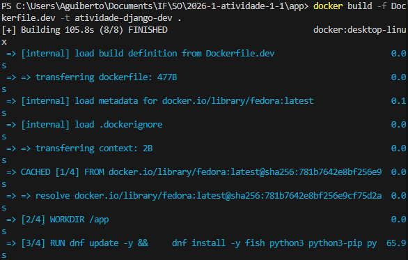
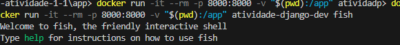
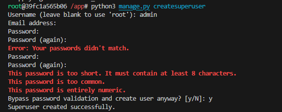
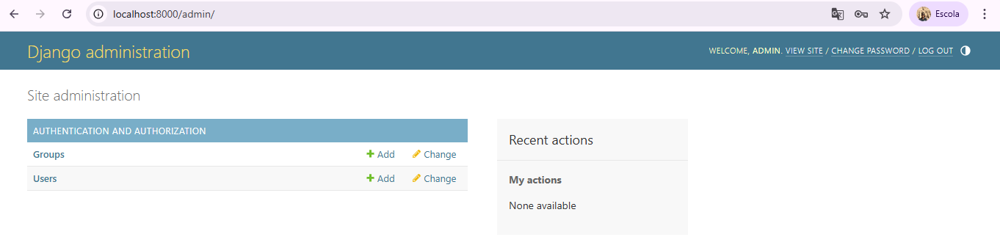
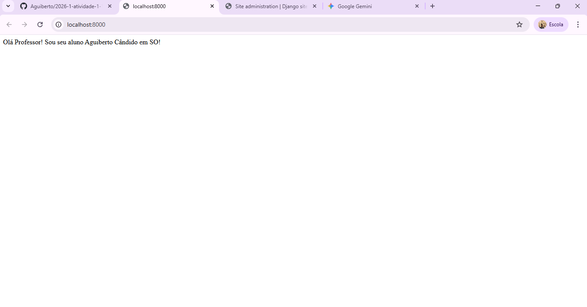

# Aguiberto Cândido da Silva Filho

## 1. INTRODUÇÃO

Esta atividade tem como objetivo aprender a criar um docker, para aplicação web que usa o Django FRAMEWORK

## 2. RELATO DAS ATIVIDADES

A ativide tem 4 etapas principais:

 1. Preparação 
 1. criação da imagem docker
 1. criação e configuração da aplicação Django 
 1. Execução da aplicação

As atividades foram todas orientadas pelo professor através de tutorial disponibilizado no GitHub assim como por meio de auxílio pessoal para sanar dúvidas e problemas que apareciam durante a atividade.

 ### 2.1 Preparação

Essa etapa é bem simplificada e não exige muita coisa, pois foi necessário somente fazer um fork do repositório, depois clonar-lo e adicionar uma pasta com um arquivo de texto que informando qual é versão do Django a ser instalada.

 ### 2.2 Criação da imagem docker

Nesse momento foi criado um arquivo Dockerfile.dev com as configurações desejadas para o projeto, no caso em questão as configurações foram determinadas pelo professor.

Apos determinar as configuração basta apenas criar o container usando o comando **BUILD**

Em seguida foi colocado o container para funcionar usando o comando **RUN**. Neste comando é definifo a porta do hosto para a porta docontainer,  também a ligação do sistema hospedeiro com a pasta onde fica a aplicação no container ("ÁREA DE TRABALHO"), e qual é a imagem docker ( criada anteriormente).

CRIAÇÃO

EXECUÇÃO

 ### 2.3 Criação da aplicação DJANGO

 ### 2.4 Execução

## 3. CONSIDERAÇÕES FINAIS

Apesar do tutorial estar bem claro de quais comando executar e como faze-los ainda sim é necessário alguma ajuda em decorrência da pouca familiariadade com o uso do terminal.
 
 Exemplo: ao criar um superusuário o sistema solicita um nome de usuário e senha , e ao colocar a senha os digitos não aparecem na tela o que me deixou um pouco confuso, mas ao consultar o assistente virtual rapidamente consegui contornar essa situação, sendo assim, trata-se meramente de uma falta de familiaridade com o uso do terminal.

 

 ## ANEXOS

 

 